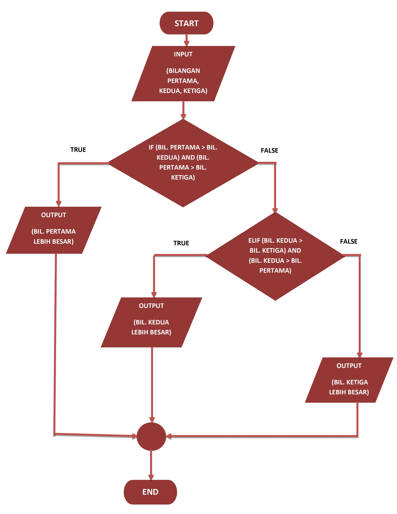
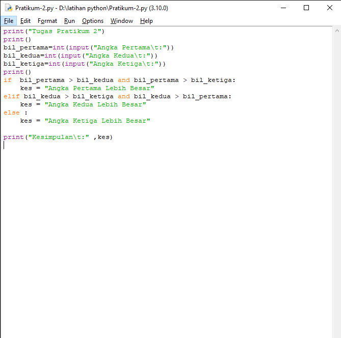

# Tugas Pratikum 2

Membuat program sederhana dengan input tiga buah bilangan, dari ketiga bilangan
tersebut tampilkan bilangan terbesarnya.

<h3>Flowchart</h3>

<h3>Program</h3>

Pada program di atas merupakan program untuk mecari bilangan tebesar dari tiga buah bilangan.

1. Menginput tiga buah bilangan.

2. Pada statement :
    ![img] screenshot/4.png
    Jika bilangan pertama lebih besar dari bilangan kedua dan bilangan pertama lebih besar dari bilangan ketiga, maka hasil yang akan ditampilkan adalah "Angka Pertama Lebih Besar".

3. Pada statement :
    ![img]
    Jika bilangan kedua lebih besar dari bilangan ketiga dan bilangan kedua lebih besar dari bilangan pertama, maka hasil yang akan ditampilkan adalah "Angka Kedua Lebih Besar".

4. Jika di luar dari statement diatas maka yang akan ditampilkan adalah "Angka Ketiga Lebih Besar".

<h3>Output Program</h3>

![img]

<h3>Sekian Terimakasih</h3>